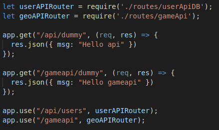
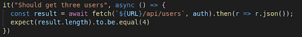
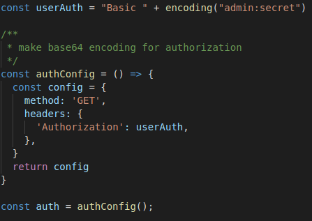
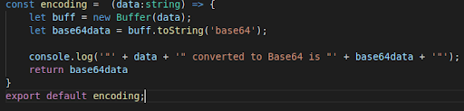
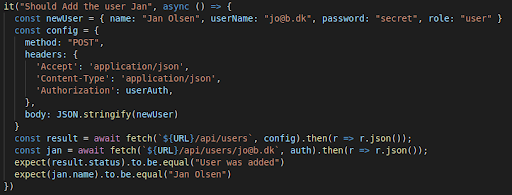
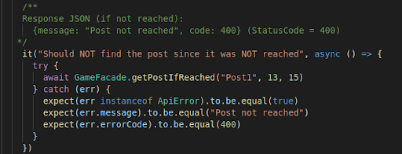
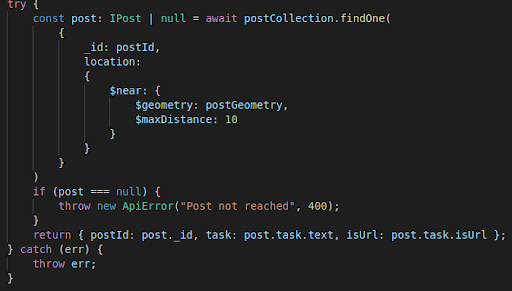
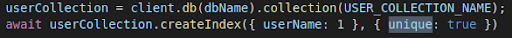
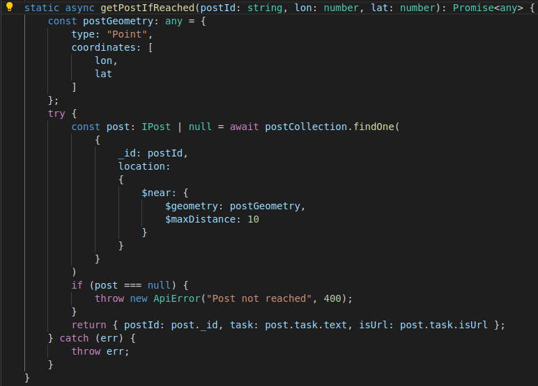

cph-ms782, Martin Bøgh Sander-Thomsen

# Fullstack Javascript

## Period-2

### Node, Express with TypeScript, JavaScript Backend Testing, MongoDB and Geo-location

#### Explain Pros & Cons in using Node.js + Express to implement your Backend compared to a strategy using, for example, Java/JAX-RS/Tomcat

**Pros:**

-   Det er lettere at sætte op og køre
-   Du kan vedhæfte parametre til request om objektet under kørsel
    (f.eks. tilføjelse af brugerrolle)**

**Cons:**

-   Ved heftig trafik er det ikke så velegnet

#### Explain the difference between *Debug outputs* and *ApplicationLogging*. What's wrong with console.log(..) statements in our backend code.  
console.log(...) statements blokerer kode flow, i et setup der ellers
er meningen skal være non-blocking.

#### Demonstrate a system using application logging and environment controlled debug statements.

Visal Code [app.ts](./week10+11/express-exercises-day1/src/app.ts)

Visal Code [logger.ts](./week10+11/express-exercises-day1/src/middlewares/logger.ts)

For at bruge debug skal man installere debug pakken (`npm install debug`)  
Derefter skriv følgende i **.env-filen**:

`DEBUG=game-case`

I starten af filen ts/js-filen:

`require('dotenv').config();`

`const debug = require("debug")("game-case");`

Fremover når man ville bruge **console.log("Hello")**, bruger man i stedet for **debug("Hello")**

#### Explain, using relevant examples, concepts related to testing a REST-API using Node/JavaScript/Typescript + relevant packages

[builtin node
assert](./week10+11/express-exercises-day1/test/simpleDemo.ts)

[Mocha
Chai](./week10+11/express-exercises-day1/test/simpleDemoWithChai.ts)

**Eksempel på async test:**  
it("Should eventually find number of files in temp folder \" + folder,
async function () {  
 try { const files: any = findFiles("./\" + folder,
".txt");

>expect(files.length).to.be.equal(5);   
} catch (err) {  
  //Observe -- normal try-catch, when you use async-await
expect(err).to.be.equal("Wrong
arguments");   
}})

[REST
test](./week10+11/express-exercises-day1/test/simpleRestTest.ts)

#### Explain a setup for Express/Node/Test/Mongo-DB development with Typescript, and how it handles \"secret values\", debug and testing.

Secret values håndteres via en skjult fil på serverne kaldet env. I den
skriver man de variable som ikke må ses i koden, men som koden skal
kunne tilgå.

#### Explain, preferably using an example, how you have deployed your node/Express applications, and which of the Express Production best practices you have followed.
[deployed server](https://express1.sandersolutions.dk/)  
Best practices:

-   pm2 til at genstarte app ved nedbrud eller genstarte
-   der er brugt ssl til cryptering af forbindelsen mellem server og klient
-   der er brugt helmet middleware til at sætte flere sikkerheds http headers
-   der er brugt async funktioner hvor det er muligt
-   der er brugt en reverse proxy

Metode til at deploye:

-   få dns til at pege på droplet og sæt nginx options til at håndtere dette request (se nedenfor).
-   clone github project i en underfolder i brugers home folder.
-   build manuelt typescript
-   start app ved hjælp af pm2
-   automatiser dette med et skript til fremtidig brug

>echo "\nGo into apps folder"  
cd apps  

>echo "\ncloning repo from https://github.com/cph-ms782/express-mongo-typescript"  
echo "if not existing"  
git clone https://github.com/cph-ms782/express-mongo-typescript.git  

>echo "\nGo into express express-mongo-typescript folder"   
cd express-mongo-typescript  

>echo "pull in latest updates"  
git pull  

>echo "\nbuild typescript"  
npm run build  

>echo "\nstart server if not already started"  
pm2 start ./build/app.js --name express1 --watch --ignore-watch="node_modules"  
pm2 status  

#### Explain possible steps to deploy many node/Express servers on the same droplet, how to deploy the code and how to ensure servers will continue to operate, even after a droplet restart.

#### Explain, your chosen strategy to deploy a Node/Express application
including how to solve the following deployment problems:

-   **Ensure that your Node-process restarts after a (potential) exception
    that closed the application**
Ved at bruge pm2 på serveren

-   **Ensure that your Node-process restarts after a server (Ubuntu)
    restart**  
Ved at bruge pm2 på serveren

-   **Ensure that you can run "many" node-applications on a single droplet
    on the same port (80)**  
I Digital Ocean dns server indstilles hvert sub-domæne til at pege på
den samme droplet (**express1**.server.com, **express2**.server.com
osv).

  Ved at ændre i nginx opsætningen på linux serveren, så den kan kan
håndtere forskellige sub-domæner. Første domæne vil have følgende
opsætningen i */etc/nginx/sites-enabled/default*. Express1 og port 5000. Den næste vil hedde express2 og 5002.

  Start flere express servere med forskellige portnumre (5000 og 5001)**

  > server\_name **express1**.server.com;  
  location / {  
  proxy\_pass http://localhost:**5000**;  
  proxy\_http\_version 1.1;  
  proxy\_set\_header Upgrade \$http\_upgrade;  
  proxy\_set\_header Connection \'upgrade\';  
  proxy\_set\_header Host \$host;  
  proxy\_cache\_bypass \$http\_upgrade;  
  }  

#### Explain, using relevant examples, the Express concept; middleware.

Middleware er kode, der kører efter var app = express (), hvor request
objektet møder den første kode og før routing delen. Middleware'n sender
bolden videre til næste middleware eller til routingen ved hjælp af
funktionen **next(),** og man kan f.eks. indsætte et sikkerheds lag her.

[*Visual Code*](./src/app.ts) -
[*github*](https://github.com/cph-ms782/express-mongo-typescript/blob/ac56c3f566185555d7b482c8d708ad933302b115/src/app.ts#L12)

#### Explain, using relevant examples, your strategy for implementing a REST-API with Node/Express + TypeScript and demonstrate how you have tested the API.
NodeJS app'en starter i typescript filen app.ts. Routing foregår i
denne fil, men bliver udgrenet i underfiler for ikke at app.ts bliver
for uoverskuelig.

[*Visual Code*](./src/app.ts) -
[*github*](https://github.com/cph-ms782/express-mongo-typescript/blob/ac56c3f566185555d7b482c8d708ad933302b115/src/app.ts#L20)

Tests ligger i rodfolderen **/test**. Alle tests der ligger heri bliver
udført, pånær hvis man f.eks giver dem typen .xx.

Eksempel på enkelt REST API GET test af **/api/users** ([*Visual
Code*](./test/endpointTest.ts) -
[*github*](https://github.com/cph-ms782/express-mongo-typescript/blob/ac56c3f566185555d7b482c8d708ad933302b115/test/endpointTest.ts#L113)).  
Normalt behøves der ikke at komme en options del med i requestet (ses
som auth i ovenstående billede), men da der er authentication på siden,
så ville testen fejle hvis denne authentication var slået til.

Auth delen ser således ud ([*Visual
Code*](./test/gameFacadeTest.ts) -
[*github*](https://github.com/cph-ms782/express-mongo-typescript/blob/ac56c3f566185555d7b482c8d708ad933302b115/test/endpointTest.ts#L26)):

userAuth, der også bruges flere steder i tests (se eksempel længere
nede), er keypairet **bruger:kodeord** lavet om til base64 encoding, som
basic http authentication kan læse ([*Visual
Code*](./src/utils/makeBase64.ts) -
[*github*](https://github.com/cph-ms782/express-mongo-typescript/blob/ac56c3f566185555d7b482c8d708ad933302b115/src/utils/makeBase64.ts#L1)):

Eksempel på både GET og POST request tests af /api/users/:userName
([*Visual Code*](./test/endpointTest.ts) -
[*github*](https://github.com/cph-ms782/express-mongo-typescript/blob/ac56c3f566185555d7b482c8d708ad933302b115/test/endpointTest.ts#L118)).
Først POST'es en ny bruger ind. Bemærk **{'Authorization': userAuth}**, hvor
et base64 bruger:kodeord keypair sendes videre i headeren. Dette
efterfølges af en GET test på om den nye bruger kan findes:

#### Explain, using relevant examples, how to test JavaScript/Typescript Backend Code, relevant packages (Mocha, Chai etc.) and how to test asynchronous code.

Mocha er et testing framework hvor man bl.a. Kan teste asyncront. Chai
er et BDD (behavior-driven development)/ TDD (test-driven dev.)
assertion library til node og browseren, der kan kobles på f.eks. Mocha.
Den gør det lettere at skrive test, da ikke programmører kan skrive dem
langt hen af vejen.

Se fra ovenstående billede:

**expect**(result.status)**.to.be.equal**(\"User was added\")

**expect**(jan.name)**.to.be.equal**(\"Jan Olsen\")

Kan også opfange exceptions ([*Visual
Code*](./test/gameFacadeTest.ts) -
[*github*](https://github.com/cph-ms782/express-mongo-typescript/blob/ac56c3f566185555d7b482c8d708ad933302b115/test/gameFacadeTest.ts#L118)):

NoSQL and MongoDB

#### Explain, generally, what is meant by a NoSQL database.

En NoSQL-database er en database der giver dig mulighed for at gemme og
hente data, der ikke er omhyggeligt modelleret på en tabelform, som du
skal med en relational database.

#### Explain Pros & Cons in using a NoSQL database like MongoDB as your data store, compared to a traditional Relational SQL Database like MySQL.

-   Ting går lidt hurtigere (hvis man har valgt det rigtige scenarie)
-   kan håndtere store mængder data
-   behøver ikke at bruge et bestemt skema at lægge data ind \#\#todo

#### Explain about indexes in MongoDB, how to create them, and *demonstrate* how you have used them.

Indexes gør det let for mongoDB at udføre søgninger. Uden disse ville
databasen skulle igennem alle datasæt for at finde den ønskede data:

MongoDB definerer indekser på collection niveau. Når en collection
sættes op i koden, kan man bruge createIndex (se nedenunder). En
collection deklarering kan se således ud: **const** **mongoDBCollection
= mongo.MongoClient.db("semester\_case").collection("positions")**

**Hvordan laves de**:

Ved at bruge **mongoDBCollection.createIndex()**:

TTL (time to live): **collection.createIndex({ lastUpdated: 1 }, {
expireAfterSeconds: 3600 })**

geoSpatial index: **collection.createIndex({ location: \"2dsphere\" })**

**Hvordan bruges de:**

De bruges i mondoDB metoder som f.eks .**find()** eller
.**findOneAndUpdate()** eller direkte af databasen selv ved f.eks. TTL
som oprettet i ovenstående.

Her ses en søgning på location indexet ([*Visual
Code*](./src/facades/gameFacade.ts) -
[*github*](https://github.com/cph-ms782/express-mongo-typescript/blob/ac56c3f566185555d7b482c8d708ad933302b115/src/facades/gameFacade.ts#L182)):

#### Explain, using your own code examples, how you have used some of MongoDB\'s \"special\" indexes like *TTL* and *2dsphere and perhaps also the Unique Index.*

TTL og 2dsphere er vist i ovenstående. Unique er brugt ved oprettelse af
en bruger, så der sikres at et værdi indsat i databasen kun kan bruges
een gang ([*Visual Code*](./src/facades/userFacadeWithDB.ts) -
[*github*](https://github.com/cph-ms782/express-mongo-typescript/blob/ac56c3f566185555d7b482c8d708ad933302b115/src/facades/userFacadeWithDB.ts#L25)):

#### Demonstrate, using a REST-API *you have designed*, how to perform all CRUD operations on a MongoDB

**CR**eate: Oprettelse af bruger:

-   REST ([*Visual Code*](./src/routes/userApiDB.ts) -
    [*github*](https://github.com/cph-ms782/express-mongo-typescript/blob/ac56c3f566185555d7b482c8d708ad933302b115/src/routes/userApiDB.ts#L21))
    POST /api/users. Sender et bruger objekt videre som opfylder kravene
    til at være en **IGameUser** ([*Visual
    Code*](./src/interfaces/GameUser.ts) -
    [*github*](https://github.com/cph-ms782/express-mongo-typescript/blob/ac56c3f566185555d7b482c8d708ad933302b115/src/interfaces/GameUser.ts#L1))
-   backend ([*Visual Code*](./src/facades/userFacadeWithDB.ts) -
    [*github*](https://github.com/cph-ms782/express-mongo-typescript/blob/ac56c3f566185555d7b482c8d708ad933302b115/src/facades/userFacadeWithDB.ts#L35)).
    addUser() modtager brugeren og opretter vedkommende med krypteret
    kodeord. Mongo metoden **insertOne** bruges til at oprette og
    bcryptjs krypterer kodeordet.

**U**pdate: Oprettelse af en position eller opdatering af eksisterende,
når der søges på omkringliggende brugere:

-   REST ([*Visual Code*](./src/routes/userApiDB.ts) -
    [*github*](https://github.com/cph-ms782/express-mongo-typescript/blob/ac56c3f566185555d7b482c8d708ad933302b115/src/routes/gameApi.ts#L52))
    POST **/api/users/nearbyplayers** med auth info og lon/lat og
    distance sendes videre til **nearbyPlayers()** i facaden
-   backend ([*Visual Code*](./src/facades/gameFacade.ts) -
    [*github*](https://github.com/cph-ms782/express-mongo-typescript/blob/ac56c3f566185555d7b482c8d708ad933302b115/src/facades/gameFacade.ts#L72)
    og
    [*github*](https://github.com/cph-ms782/express-mongo-typescript/blob/ac56c3f566185555d7b482c8d708ad933302b115/src/facades/gameFacade.ts#L151))
    **nearbyPlayers** søger på andre brugere og opdaterer samtidig
    søgerens position i databasen via **findNearbyPlayers**. Denne kører
    mongo metoden **findOneAndUpdate** med **upsert** sat i options, så
    der oprettes hvis positionen ikke eksisterer.

**D**elete: Fjernelse af en bruger:

-   REST ([*Visual Code*](./src/routes/userApiDB.ts) - [*github*](https://github.com/cph-ms782/express-mongo-typescript/blob/ac56c3f566185555d7b482c8d708ad933302b115/src/routes/userApiDB.ts#L99))
    DELETE /**api/users/:userName** sender brugernavn videre til
    **userFacade.deleteUser()** (hvis auth er slået til skal man være
    admin), userName kommer fra URL parameter og admin role kommer fra
    request objektet.
-   backend ([*Visual Code*](./src/facades/userFacadeWithDB.ts)
    [*github*](https://github.com/cph-ms782/express-mongo-typescript/blob/ac56c3f566185555d7b482c8d708ad933302b115/src/facades/userFacadeWithDB.ts#L50))
    **deleteUser**() benytter mongo metoden .**findOneAndDelete()** til
    at fjerne en bruger. Der kommer en exception hvis brugeren ikke kan
    findes.

#### Demonstrate, using your own code-samples, decisions you have made regarding → normalization vs denormalization

WIKI: Denormalization er en strategi, der bruges i en tidligere
normaliseret database for at øge ydelsen. Ved beregning er
denormalisering processen med at forsøge at forbedre en databas læseevne
på bekostning af at miste nogle skrivepræstationer, ved at tilføje
overflødige kopier af data eller ved at gruppere data. Det er ofte
motiveret af ydeevne eller skalerbarhed i relationel databasesoftware,
der har behov for at udføre meget store antal læseoperationer.

I dette tilfælde er det mere en normalisering af domænemodellen. Task og
Point der kunne have været hver for sig i en normaliseret database,
samles i en collection kaldet "posts". Det ses i funktionen
**getPostIfReached()** ([*Visual
Code*](./src/facades/gameFacade.ts) -
[*github*](https://github.com/cph-ms782/express-mongo-typescript/blob/6b867e37f67de4ec3cabf150095a33e9c5ef9336/src/facades/gameFacade.ts#L174)
nedenstående billede) . Point delen bruges til at finde posten og task
delen til at svare tilbage hvis posten bliver fundet.

## Geo-location and Geojson

#### Explain and demonstrate basic Geo-JSON, involving as a minimum, Points and Polygons

GeoJSON er en måde at repræsentere geografiske data på. Det er et åbent
standardformat designet til at repræsentere enkle geografiske
funktioner.

#### Explain and demonstrate ways to create Geo-JSON test data

Når der testes bruges normale metoder til at oprette data. En forskel
dog er hvor lang tid at positionen overlever i databasen da optionerne
**lastUpdated** og **expiresAfterSeconds** kan være sat så positionerne
forsvinder efter kort tid. Derfor er det praktisk at sætte lastUpdated
langt ude i fremtiden, så den ikke forsvinder så hurtigt, når der
testes.

[*Opretning af test
data*](https://github.com/cph-ms782/express-mongo-typescript/blob/bb5e7088dc8ff47d042a67a0a68aadeb2793c0e8/test/gameFacadeTest.ts#L52)  
[*positionCreator*](https://github.com/cph-ms782/express-mongo-typescript/blob/bb5e7088dc8ff47d042a67a0a68aadeb2793c0e8/src/utils/geoUtils.ts#L19) der bruges til at oprette et point objekt at typen IPosition  
[*Test kode*](./test/gameFacadeTest.ts)

#### Explain the typical order of longitude and latitude used by Server-Side API's and Client-Side API's
-   longitude, latitude (som X,Y) brugt af de fleste formater og er Open
Geospatial Consortium's anbefaling
-   latitude, longitude (som Y,X) brugt især af Google, map software og
client-side teknologier (inkl. Airbnb's, google maps)
-   Udvikleren er ansvarlig for at finde ud af, hvad der bruges.

#### Explain and demonstrate a REST API that implements geo-features, using a relevant geo-library and plain JavaScript
Ved hjælp af npm modulet 'geojson-utils' kan man lave let lave geo
beregninger, som;

-   hvor langt er der imellem to punkter
    [*facade*](https://github.com/cph-ms782/express-mongo-typescript/blob/bb5e7088dc8ff47d042a67a0a68aadeb2793c0e8/src/facades/gameFacade.ts#L273) -
    [*REST*](https://github.com/cph-ms782/express-mongo-typescript/blob/bb5e7088dc8ff47d042a67a0a68aadeb2793c0e8/src/routes/gameApi.ts#L70)
-   er et punkt indenfor en geometri
    [*facade*](https://github.com/cph-ms782/express-mongo-typescript/blob/bb5e7088dc8ff47d042a67a0a68aadeb2793c0e8/src/facades/gameFacade.ts#L240) -
    [*REST*](https://github.com/cph-ms782/express-mongo-typescript/blob/bb5e7088dc8ff47d042a67a0a68aadeb2793c0e8/src/routes/gameApi.ts#L98)
-   hvilke punkter er indenfor en geometri.
    [*facade*](https://github.com/cph-ms782/express-mongo-typescript/blob/bb5e7088dc8ff47d042a67a0a68aadeb2793c0e8/src/facades/gameFacade.ts#L254)
    (REST er overtaget af mongoDB versionen nedenunder)

Kode [*facade*](./src/facades/gameFacade.ts) - [*REST
API*](./src/routes/gameApi.ts)

**TODO : demonstrate**

#### Explain and demonstrate a REST API that implements geo-features, using Mongodb's geospatial queries and indexes.**  
Med mongoDB kan man gemme lokationer og finde interne relationer imellem
disse. Ved at oprette geo-indexes (som f.eks. {location: \"2dsphere\"}),
kan man søge på disse ved hjælp af mongoDB commandoer som .**find()**
eller .**findAndUpdateUser()**. I søgningen kan man specificere om man
vil sætte en position ( \$**set**: {position} eller finde personer i
nærheden (\$**near**: {\$**geometry**, \$**maxDistance**} ).

Man kan sætte nogle options ved disse søgninger. **upsert** sørger for
at der oprettes et nyt dokument hvis det ikke findes i forvejen, og
**returnOriginal** der returnerer det opdaterede værdig (i modsætning
til default der er at returnere den gamle værdi)**e**

-   Spillere i nærheden  
    [*facade*](https://github.com/cph-ms782/express-mongo-typescript/blob/bb5e7088dc8ff47d042a67a0a68aadeb2793c0e8/src/facades/gameFacade.ts#L72)  
    [*query*](https://github.com/cph-ms782/express-mongo-typescript/blob/bb5e7088dc8ff47d042a67a0a68aadeb2793c0e8/src/facades/gameFacade.ts#L121)  
    [*REST*](https://github.com/cph-ms782/express-mongo-typescript/blob/bb5e7088dc8ff47d042a67a0a68aadeb2793c0e8/src/routes/gameApi.ts#L52)

**TODO : demonstrate**
